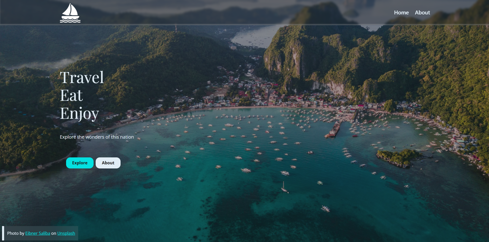

# 🌍 Travel Explore

**Travel Explore** is a modern, minimalist travel blog post designed to demonstrate smooth, high-performance scroll-driven interfaces using advanced GSAP timelines.

Developed with 💻 by [Joshua Glenn R. Gulbin](https://github.com/gulbin-dev).

---

## 🖼️ Preview

---

## 🛠️ Built With

An optimized frontend architecture built for speed and fluid runtime animations:

- **Framework** — [TanStack Start](https://tanstack.com) (Full-stack React framework)
- **Library** — [React.js](https://react.dev) (Component-driven UI framework)
- **Animation** — [GSAP](https://gsap.com) (GreenSock Animation Platform)
- **Language** — [TypeScript](https://typescriptlang.org) (Strictly typed Javascript ecosystem)
- **Bundler** — [Vite](https://vite.dev) (Fast development build tool)

---

## 🔗 Connect with Me

Feel free to explore my work or reach out for collaborations:

- 🌐 **Portfolio:** [portfolio-gulbindev.vercel.app](https://portfolio-gulbindev.vercel.app/)
- 🐙 **GitHub:** [@gulbin-dev](https://github.com/gulbin-dev)
- ✉️ **Email:** [gulbindev@gmail.com](mailto:gulbindev@gmail.com)
